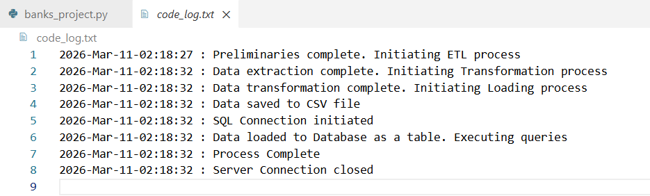

# World's Largest Banks: Quarterly ETL Pipeline

An automated data engineering pipeline designed to extract, transform, and load information regarding the top 10 largest banks in the world by market capitalization. This project ensures financial reports are generated consistently every financial quarter with multi-currency support (GBP, EUR, and INR).

## Project Scenario
You have been tasked with creating an automated system for a research organization to compile a list of the top 10 largest banks in the world, ranked by market capitalization in billion USD. 

Because the organization operates globally, the data must be transformed into multiple currencies based on a provided exchange rate CSV file. The final processed data is stored in both a flat-file format (CSV) and a relational database (SQL) for further querying.

## Tech Stack
* **Language:** Python 3.11
* **Libraries:**
    * `pandas`: For data manipulation and currency calculations.
    * `BeautifulSoup`: For web scraping the Wikipedia source.
    * `requests`: To access the web archives.
    * `sqlite3`: To manage and query the SQL database.
    * `datetime`: To provide precise timestamps for logging.

## Project Structure
* `banks_project.py`: The main Python script containing the ETL logic.
* `exchange_rate.csv`: Input file containing exchange rates for GBP, EUR, and INR.
* `largest_banks.csv`: Output file containing the final transformed data.
* `Banks.db`: SQLite database where the data is loaded as a table.
* `code_log.txt`: A log file that tracks the progress of the ETL process.

## ETL Pipeline Details

### 1. Logging Progress
Every step of the process—from initialization to completion—is recorded with a timestamp. This ensures auditability and easier debugging.

### 2. Extraction
The script scrapes data from the Wikipedia "List of largest banks" page. It specifically targets the market capitalization table and extracts the Bank Name and Market Cap in USD.

### 3. Transformation
Using the `exchange_rate.csv`, the script converts the USD market cap into:
* **GBP (British Pound)**
* **EUR (Euro)**
* **INR (Indian Rupee)**

All values are rounded to 2 decimal places.

### 4. Loading
The transformed data is loaded into two destinations:
* **Local CSV:** `largest_banks.csv`
* **SQL Database:** A table named `Largest_Banks` in `Banks.db`.

### 5. Automated Querying
After loading, the system runs predefined SQL queries to verify the data, such as calculating the average market capitalization in GBP.

## How to Run

1. **Clone the Repository:**
   ```bash
   git clone https://github.com/jay-peddi-1299/Worlds-Largest-Banks-Quarterly-ETL-Pipeline.git
   cd Worlds-Largest-Banks-Quarterly-ETL-Pipeline

2. **Verify Dependencies:**
   ```bash
   pip install pandas
   pip install bs4

3. **Run the Pipeline:**
   ```bash
   python3.11 banks_project.py

4. **Check the Logs:**

   
